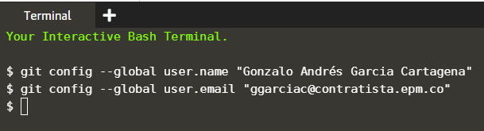

## Instrucciones Uso de la plataforma

Cuando se le indique que copie o ejecute un comando que tenga esta apariencia `(ícono de 2 hojas)`{{copy}} debe darle clic en el ícono y se copiará automáticamente en el portapapeles. Vamos a probar, ejecuta el siguiente comando en la consola `echo "hola mundo"`{{copy}}, recuerda dar clic en el ícono de las 2 hojitas, luego da clic derecho en la consola y seleciona PEGAR, para ejecutar el comando oprime la tecla enter.

Hay comandos que no tendrás que copiar y pegar manualmente como el anterior, solo con dar clic encima de ellos se ejecutará en la consola automáticamente. Ejemplo, ejecuta el siguiente comando `echo "hola mundo"`{{execute}}, ¿viste que se ejecutó solo?.

En algunos ejercicios te pediremos que ejecutes un comando pero cambiando alguna palabra, para hacer esto copia el comando como te enseñamos inicialmente, pégalo en la consola y con la ayuda de las teclas de dirección izquierda y derecha puedes mover el cursor, para borrar puedes utilizar la tecla Supr o Del. Para ejecutar el comando oprime la tecla enter.

Ejemplo ejecuta el siguiente comando cambiando TU_NOMBRE por el tuyo y manteniendo las comillas `echo "hola mundo, soy TU_NOMBRE"`{{copy}}, se debió haber impreso en la consola el mensaje de "hola mundo, soy TU NOMBRE REAL"

En algunos casos se te pedirá que cambies algo en un comando por tu nombre sin espacios, puedes separarlos por guión bajo. Ejemplo: Gonzalo_Andres_Garcia.

## Inicio

Suponiendo que ya tienes git instalado en tu dispositivo, debes hacer algunas cosas para personalizar tu entorno de Git. Es necesario hacer esta configuración solo una vez en tu computadora y se mantendrán entre actualizaciones. También puedes cambiarlas en cualquier momento volviendo a ejecutar los comandos correspondientes.

Git trae una herramienta llamada git config, que te permite obtener y establecer variables de
configuración que controlan el aspecto y funcionamiento de Git. Estas variables pueden
almacenarse en tres sitios distintos. (Global, Usuario, Repositorio).

## Tarea

Lo primero que deberás hacer cuando instales Git es establecer tu nombre de usuario y dirección
de correo electrónico. Esto es importante porque los "commits" de Git usan esta información, y es
introducida de manera inmutable en los commits que envías:

Para la configuración inicial ejecuta los siguientes comandos, sustituyéndolos con tus datos reales y manteniendo las comillas.

`git config --global user.name "Tu Nombre Completo"`{{copy}}

`git config --global user.email "tucorreo@mail.com"`{{copy}}

## Muestra de resultado esperado

En la mayoría de pasos se te mostrará el resultado que debiste tener al ejecutar la tarea, tenga en cuenta que en algunos casos puede diferir el resultado esperado con tu resultado (ejm: nombres de ramas). Con esto puedes validar si ejecutaste bien las tareas.

## Nota

Recuerda, sólo necesitas hacer esto una vez si especificas la opción `--global`, ya que Git siempre
usará esta información para todo lo que hagas en ese sistema. Si quieres sobrescribir esta
información con otro nombre o dirección de correo para proyectos específicos, puedes ejecutar el
comando sin la opción --global cuando estés en ese proyecto.