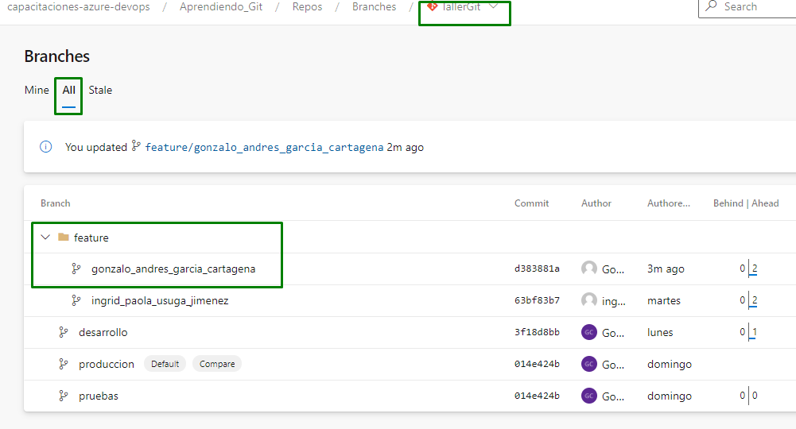

Para poder colaborar en cualquier proyecto Git, necesitas saber cómo gestionar repositorios remotos. Los repositorios remotos son versiones de tu proyecto que están hospedadas en Internet (ejemplo Azure DevOps) o en cualquier otra red.

Colaborar con otras personas implica gestionar estos repositorios remotos enviando y trayendo datos de ellos cada vez que necesites.

## Tarea

Este se trata de que entres al repositorio remoto y veas el reflejo de tu trabajo :-)

Ahora que ya subiste al repositorio remoto los cambios de tu nueva rama. Ingresa a la siguiente dirección url, allí deberías poder ver la rama que acabaste de subir. Tenga en cuenta que Azure DevOps por cada slash / que tenga el nombre de la rama va a visual una especia de carpeta dentro de la interfaz web, entonces deberías buscarla dentro de la carpeta feature.

https://dev.azure.com/capacitaciones-azure-devops/Aprendiendo_Git/_git/TallerGit/branches?_a=all

Si encontraste tu rama, !Felicitaciones¡. Da clic en ella y mira los cambios que hiciste.

## Muestra de resultado esperado

## Nota

En el mundo real, suponiendo que se está manejando también una estrategia de ramas (desarrollo, pruebas y producción), el paso siguiente sería crear un pull request de esa rama que creaste a la rama de desarrollo, con el fin de que lo integres con esa rama.