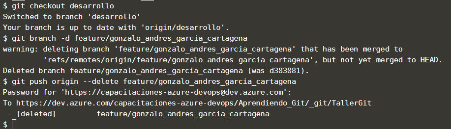

## Tarea Plus

Suponiendo que ya completaste todo el trabajo que estabas desarrollando en la rama feature/* ya podrías proceder a eliminar la rama local y remota con los siguientes comandos: 

Antes de eliminar una rama asegúrate de que has subido todos los cambios y también debes situarte en una rama distinta para poder eliminarla.

Para pasarse a una rama distinta usa el siguiente comando `git checkout desarrollo`{{execute}}

Eliminar la rama local: `git branch -d feature/nombre_de_la_rama_a_eliminar`{{copy}}
Eliminar la rama Remota: `git push origin --delete feature/nombre_de_la_rama_a_eliminar`{{copy}} también la puedes eliminar desde la interfaz del repositorio remoto (Azure DevOps, GitHub)

Si te pide contraseña, recuerda ingresar este token `tb3yofvnvj2dunk5ty6xlq6574lmk66eqnbfltjazlyjwedix2kq`{{copy}} Note preocupes si parece que no hubieras copiado nada, oprime la tecla enter y listo.

Recuerda que este token solo funciona para este ejercicio.

## Muestra de resultado esperado

