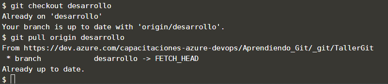

## Tarea Plus

Suponga que tienes un nuevo desarrollo distinto a lo que completaste en los pasos anteriores, lo que debes hacer para seguir trabajando con el repositorio que clonaste en los primeros pasos es:

Pasarte a la rama de desarrollo `git checkout desarrollo`{{execute}}
Realizar un pull para actualizar la rama local desarrollo con la rama remota desarrollo (descargar los últimos cambios) `git pull origin desarrollo`{{execute}}

luego de esto podrías seguir los mismos pasos desde el punto 5 de este ejercicio.

Ya con esto tienes el conocimiento necesario para trabajar colaborativamente con git ¡Felicitaciones¡

## Muestra de resultado esperado

## Nota 

Si quieres descargar localmente una rama que ha subido otro compañero al repositorio remoto, puedes ejecutar el siguiente comando:

`git fetch`{{execute}} esto actualizará las referencias a las ramas remotas en tu repositorio local.
Lista las ramas remotas con `git branch -a`{{execute}} para asegurarte de que si hayan actualizado las referencias.

Para crear una rama a partir de la rama remota ejecuta el comando `git checkout -b nombre_rama_local origin/nombre_rama_remota`{{copy}}