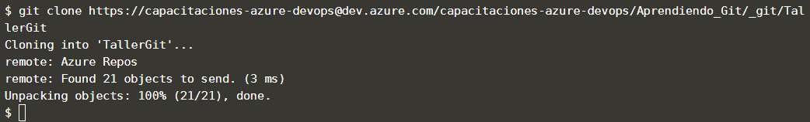

Los repositorios remotos le permiten compartir cambios desde o hacia su repositorio. Los repositorios remotos se clonan usando el comando `git clone <remote-url>` donde `<remote-url>` es la ubicación remota, generalmente una URL HTTPS.

## Tarea

Usando el comando `git clone`, clone el repositorio remoto con el que se desarrollarán los siguientes pasos de este escenario.

`git clone https://capacitaciones-azure-devops@dev.azure.com/capacitaciones-azure-devops/Aprendiendo_Git/_git/TallerGit`{{execute}}

## Muestra de resultado esperado

## Nota

Cuando usa el comando `git clone`, se agregará automáticamente como remoto con el nombre de `origin` la ubicación desde la que está clonando.

Normalmente solo se clona una vez y luego por medio de comandos actualizamos el repositorio local con el repositorio remoto.