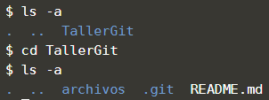

Cuando clonamos un repositorio, por defecto se crea un directorio con el nombre del repositorio, inicializa un directorio .git en su interior, descarga toda la información de ese repositorio y saca una copia de trabajo de la última versión. 
Si ingresas al directorio TallerGit, verás que están los archivos del proyecto listos para ser utilizados. 

## Tarea

Primero que todo ejecuta el comando `ls -a`{{execute}} para que observes que se creó una nueva carpeta llamada TallerGit.

Con el siguiente comando puede pasar la consola de comandos al directorio "TallerGit" que es el directorio donde se clonó el repositorio `cd TallerGit`{{execute}}

Si quieres listar los archivos y carpetas incluidos los ocultos como la carpeta .git, debes ejecutar el comando `ls -a`{{execute}} en linux.

## Muestra de resultado esperado

## Nota

Estos comandos se usan en este paso de forma educativa, sin embargo en la vida real esto lo harías directamente en tu explorador de archivos.