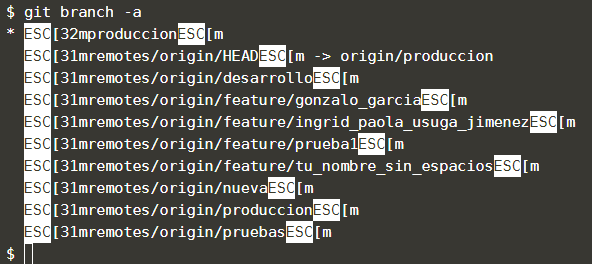

En el día a día del trabajo con Git una de las cosas útiles que podemos hacer es trabajar con ramas. Las ramas son caminos que puede tomar el desarrollo de un software, algo que ocurre naturalmente para resolver problemas o crear nuevas funcionalidades. En la práctica permiten que nuestro proyecto pueda tener diversos estados y que los desarrolladores sean capaces de pasar de uno a otro de una manera ágil.

## Tarea

Observación: en la consola de esta plataforma no se muestran bien las ramas, salen unos caracteres que no son del nombre real, algo como ESC[32 o ESC[m. No prestes atención a esos caracteres.

Si quieres listar las ramas que tenemos en nuestro repositorio, incluidas las ramas remotas, debes ejecutar el comando
`git branch -a`{{execute}}

La rama que actualmente está seleccionada sale con un * al inicio.

## Muestra de resultado esperado

## Nota

Al realizar la clonación, se crea una rama local con la rama por defecto configurada en el repositorio remoto, en este caso la rama de producción.