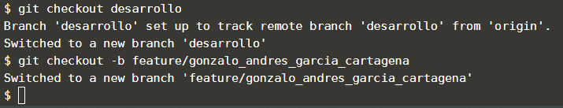

Este repositorio tiene 3 ramas principales: produccion, pruebas y desarrollo. En el paso anterior vimos que la rama de produccion es la rama por defecto. Estas 3 ramas tienen políticas en el repositorio remoto, por lo que no se pueden enviar cambios directamente a él desde estas 3 ramas. Por este motivo se requiere que crees una nueva rama basada en la rama desarrollo, para que puedas hacer y enviar modificaciones al repositorio remoto.

## Tarea

Primero que todo debes ejecutar el siguiente comando para pasarse a la rama de desarrollo.

`git checkout desarrollo`{{execute}}

Ahora que estás ubicado en la rama de desarrollo, lo que sigue es crear una nueva rama a partir de desarrollo. Para crear una nueva rama y saltar a ella en un solo paso se debe ejecutar el siguiente comando **(reemplaza el nombre de ejemplo por el nombre tuyo completo separado por \_ sin caracteres especiales ni tildes,**Ejemplo 

`git checkout -b feature/jorge_alonso_cadavid_garcia`{{copy}}). 

Esto se hace con el fin de que no hayan ramas con el mismo nombre en distintos participantes y puedas identificar tus cambios en los ejercicios posteriores.
 
Tenga en cuenta el nombre de la rama porque lo necesitarás saber en los pasos posteriores.

## Muestra de resultado esperado

## Nota

En el mundo real, en vez del nombre puedes nombrarlo con la identificación de la historia de usuario, nombre del sprint, nombre que identifica el cambio, etc, lo importante es que dentro del equipo haya un acuerdo del nombramiento de las ramas feature/*.

`git checkout -b feature/jorge_alonso_cadavid_garcia` con la opción -b en realidad es un atajo de los siguientes 2 comandos:

1- `git branch feature/jorge_alonso_cadavid_garcia`. Este comando crea la rama pero no se pasa a ella.
2- `git checkout feature/jorge_alonso_cadavid_garcia`. Con este comando te puedes pasar a la rama que creaste.