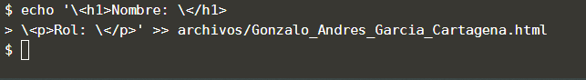

En este paso se creará un archivo .html con tu información, este archivo lo debes crear por medio de comandos debido a las limitaciones de esta plataforma. No te preocupes va a ser fácil y te daremos todas las indicaciones de como hacerlo.

## Tarea

Copia el siguiente comando en la consola, reemplaza el texto "Tu_Nombre_Completo_Sin\_Espacios.html" por tu nombre real, sin espacios o separado por guion bajo _. Mantenga la palabra archivos/ y la extensión .html. Con esto se crera un nuevo archivo html en la carpeta archivos.

`echo "<h1>Nombre: </h1>
\
Rol: 
" >> archivos/Tu_Nombre_Completo_Sin_Espacios.html`{{copy}}

Ahora que el archivo está creado, búscalo en la parte superior, (De clic en la carpeta "TallerGit", luego da clic en la carpeta "archivos", busca el archivo recién creado y de clic sobre él para abrirlo, ahora que tienes el archivo abierto en el editor modifícalo con tus datos. No es necesario guardar, ya que en esta plataforma se guarda automáticamente cada cambio en el editor de archivos.

Si ya tienes el archivo .html con tus datos, puedes pasar al siguiente paso.

Tenga en cuenta el nombre del archivo porque puede que lo necesites saber en los pasos posteriores.

## Muestra de resultado esperado

## Nota

El nombre del archivo .html no tiene nada que ver con el nombre de las ramas, puede que este ejercicio estos 2 nombres sean similares pero es por la forma en como está definido el taller, pero no tienen que ver en nada.

En tu día a día puedes crear y modificar los archivos con cualquier editor o herramienta que uses para desarrollar, en este ejercicio se hace por medio de comandos por las características que ofrece esta plataforma de aprendizaje.