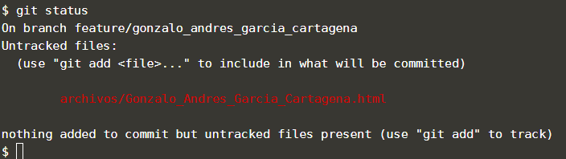
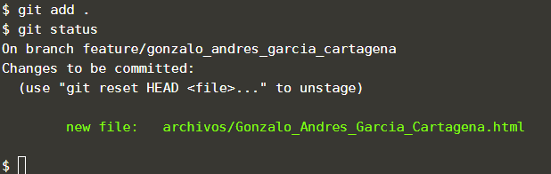

Puede ver cuáles archivos han cambiado entre el directorio de trabajo y lo que se ha enviado previamente al repositorio usando el comando `git status`.  

El resultado de este comando se denomina "estado del árbol de trabajo".

## Tarea

Use el comando `git status`{{execute}} para conocer el estado del repositorio.

Debió aparecerte el archivo que creó en el paso anterior como "untracked", significa que es un archivo nuevo que no esta seguido por git.

Para agregar todos los archivos nuevos y modificados a la zona de preparación (stagging) debes ejecutar el comando `git add .`{{execute}}

Vuelve a usar el comando `git status`{{execute}} para que observes que ya debió haber cambiado el estado del archivo (muestra que está listo para confirmar).

## Muestra de resultado esperado

## Nota

Git "no rastrea" todos los archivos hasta que se indique lo contrario.
Puedes usar el comando `git add <nombre de tu archivo o carpeta` para agregar archivos o carpetas específicas a la zona de preparación.