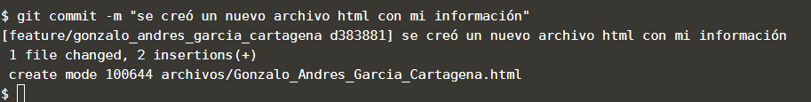

Una vez que se ha agregado un archivo al área de preparación, ya puede ser enviado al repositorio. El comando `git commit -m "mensaje de confirmación"` mueve archivos del área de preparación al repositorio y registra la fecha / hora, el autor y un mensaje de confirmación que se puede usar para agregar contexto y razonamiento adicionales a los cambios.  

Solo se confirmarán los cambios agregados al área de preparación, no se incluirán los archivos en el directorio de trabajo que no se hayan preparado.  

## Tarea

Utilice `git commit -m "se creó un nuevo archivo html con mi información"`{{execute}} para confirmar el archivo preparado.

## Muestra de resultado esperado

## Nota

El comando `git commit` y  `git add` funciona también para múltiples archivos.

A cada confirmación se le asigna un hash SHA-1 que le permite volver a consultar la confirmación en otros comandos.

Sugerencias:

1. Hacer commits con más frecuencia
2. Revisar el código antes de hacer commit
3. Evitar commits con códigos a la mitad
4. Escribir buenos mensajes en los commits
5. hay que compartir código completo
